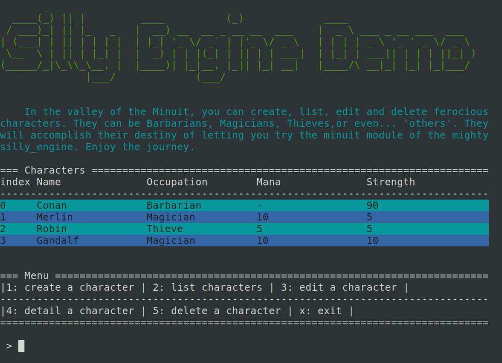

# Silly Engine

expected compatibility: python3.10+

The Silly Engine is a bunch of easy-to-handle tools to create quickly python terminal interfaces, nothing too fancy, considering this:

- keep it simple
- keep it light
- no tier library import ! all included.

**The demos included in this repo are the documentation.**

## Includes

- **minuit.py**: the TUI tools (handle forms, arrays, menus...)
- **router.py**: an alternative to argparse based on routes instead of flags
- **logger.py**: a pre-built logger
- **jsondb.py**: NOSQL-like interface for data storage in a json file.
- **text_tools.py**: I admit this one is fancy (see the picture upper ?), requires an ascii map (like the one following)
- **ascii_map_01.py**: you could create your own, if so 2 rules:
  - create at least a character for "space"
  - all your letters must have the same number of lines.

## Expected use

Copy/paste the Silly Engine in your porject. Then use it, the code is simple enought to be modified it if you want to. Fork it, customize it, make it yours, or just use it as it comes, and feel free to give some feedback. Enjoy :)
